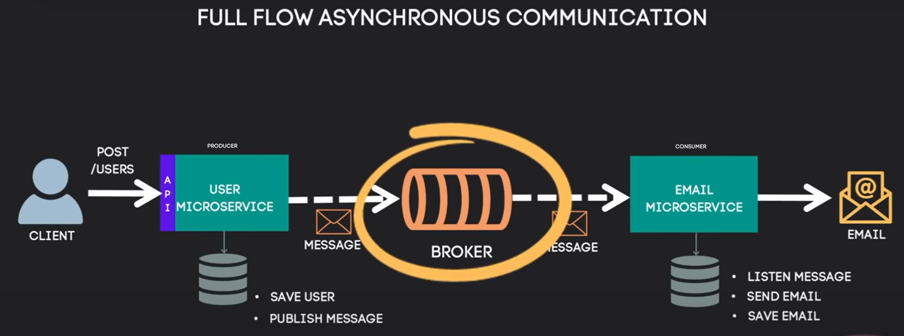

# Asynchronous Communication Between Microservices Using RabbitMQ

## Project Description
This project demonstrates the asynchronous communication flow between two microservices using RabbitMQ as a message broker. The scenario involves registering a new user and sending a confirmation email.

## Project Flow
1. Client will send a POST request to the "/users" endpoint of the "User Microservice" to register a user.
2. Once the "User Microservice" receives the new user:
   - 2.1 It saves the user in the database (as it is responsible for managing users in the system).
   - 2.2 Then, it publishes a message to the Broker (RabbitMQ) to handle asynchronous communication.
3. The Broker's Exchange checks and processes the message, then routes it to the respective queues.
4. The "Email Microservice," which is connected to the Broker:
   - 4.1 Consumes the message.
   - 4.2 Sends a "Registration Successful" confirmation email.
   - 4.3 Finally, it saves the email record in the database.

This flow enables asynchronous communication, ensuring decoupling between the microservices for improved scalability and fault tolerance.

## Technologies Used

1. **Java (version 17)**: Core programming language used to build the microservices.
2. **Maven**: Dependency management tool used to handle project libraries and build the project.
3. **Spring Ecosystem**:
   - **Spring Boot**: To bootstrap and run the business microservices.
   - **Spring Web**: To create RESTful endpoints.
   - **Spring Data JPA**: To interact with the database and handle transactions.
   - **Spring Validation**: To validate API inputs.
   - **Spring AMQP**: To work with messaging protocols for asynchronous processing.
   - **Spring Mail**: To send confirmation emails to users.
4. **PostgreSQL**: The relational database used to store user and email information.
5. **RabbitMQ**: Message broker used for asynchronous communication (hosted on Cloud AMQP).
6. **Cloud AMQP**: RabbitMQ hosted in the cloud to manage message queues.
7. **SMTP (Google Mail)**: SMTP server used to send confirmation emails.

